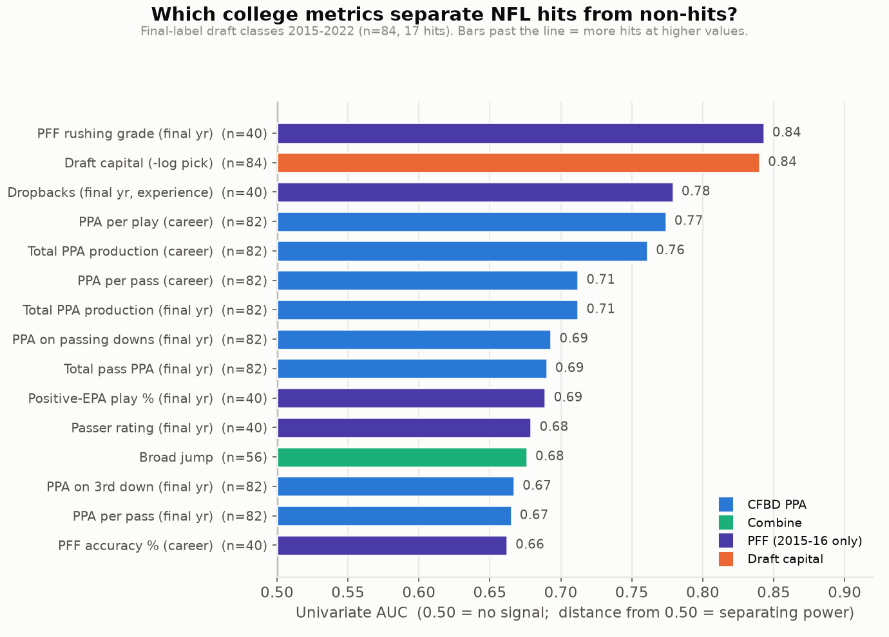
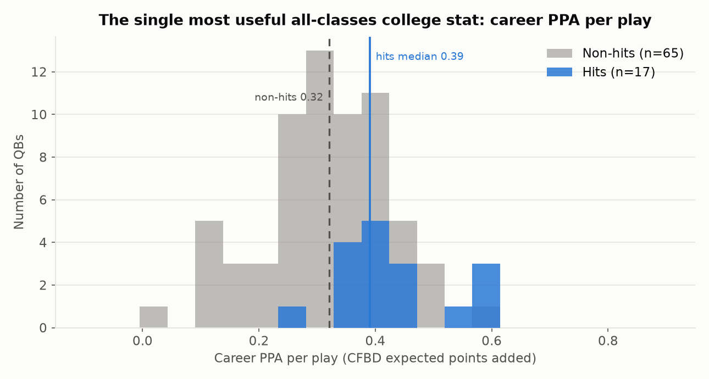
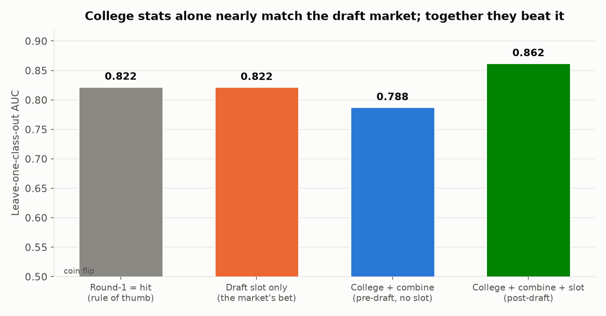
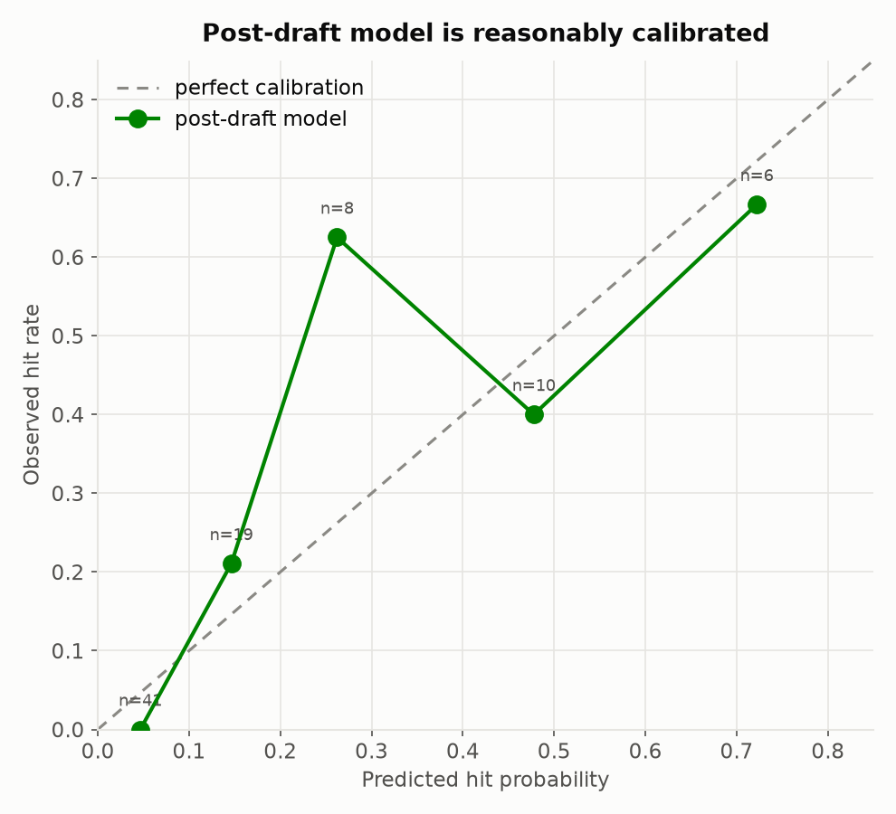

# What Defines NFL Success, From College Data

*QB draft-projection project — modeling & analysis writeup. Generated 2026-07-06.*

**The one-sentence answer:** among the college numbers we can measure, **how much
value a quarterback added per play in college (CFBD's PPA / expected points added)
is the most reliable, all-classes-available signal of NFL success** — and it
predicts NFL hits almost as well as knowing where a QB was drafted. Draft slot is
still the single strongest predictor (the market is smart), but college production
carries real, independent information, and it earns its keep most in the **middle
and late rounds**, where it flags the Dak Prescotts and Brock Purdys the market
left on the board.

---

## 1. Setup: the sample, the labels, and what to distrust

**The question.** Which college metrics indicate NFL success for QBs, and can we
train a model that projects newer draft classes?

**The ground truth.** Every QB drafted 2015–2025 is hand-labeled with a
`success_tier` (0 = washout → 4 = franchise/elite) and a binary `hit` (tier ≥ 3 =
became at least a quality long-term starter). See `data/labels/README.md`.

**What we train on.** Only **final** labels — draft classes **2015–2022** — where a
career is observed long enough to grade honestly. That is **84 quarterbacks, of
whom 17 are hits (20%)**. We add the 13 **provisional** 2023 QBs at half weight
(documented below). We **never** train on the 2024–25 "projection target" classes —
those are the held-out prediction subjects.

**The eligible-QB counts we actually joined:**

| label group | classes | QBs joined | hits |
|---|---|---|---|
| final (train) | 2015–2022 | 84 | 17 |
| provisional (train, weight 0.5) | 2023 | 13 | 1 (Stroud) |
| projection targets (scored, never trained) | 2024–25 | 23 | — |

**Six labeled QBs could not be joined** to a college profile — all are CFBD-only /
FCS / non-combine players (no PFF and no combine seed row): Ben DiNucci, Tommy
Stevens, Kellen Mond, Chris Oladokun, Sean Clifford, and Cam Miller. **Every one is
a tier 0–1 non-hit**, so dropping them removes easy negatives but no hits; it does
not inflate the model's apparent skill. All other 120 labeled QBs joined cleanly
(118 by normalized-name + draft-year; Chad Kelly and Alex McGough by name+college,
because their profile's `draft_season` is a PFF-proxy year).

**Three caveats that shape everything below:**

1. **Selection bias.** We only have outcomes for *drafted* QBs. "What separates a
   hit from a bust" is really "what separates a hit from a bust *among QBs good
   enough to be drafted*." The undrafted-QB comparison doesn't exist in this data.
2. **The PFF coverage gap.** PFF college charting currently exists **only for the
   2014 and 2015 college seasons.** That makes PFF a true *final-season* snapshot
   only for the **2015 and 2016 draft classes**; for later classes the "final" PFF
   row is actually a 2015 underclassman season (sometimes at a prior school —
   Kyler Murray's is at Texas A&M, Jarrett Stidham's at Baylor), and some are tiny
   cameo samples (Josh Allen: 8 dropbacks). **PFF is therefore used for *indicator
   analysis only* (heavily caveated), never in the deployable model.** CFBD PPA
   (2014–2025) and combine testing (2016–2026) are the backbone that covers every
   class, including 2026.
3. **Tiny n.** 17 hits is not a lot. We lean on rank-based effect sizes and
   leave-one-draft-class-out validation, and we report honest uncertainty rather
   than pretending 84 QBs settle the question.

---

## 2. Which metrics separate hits from non-hits? (univariate)

For every candidate metric we ask a simple, robust question: *if you pick a random
hit and a random non-hit, how often does the hit have the higher value?* That is
the **univariate AUC** — 0.50 means the metric is noise; distance from 0.50 is
separating power. Full tidy table: **`model/indicators.csv`**.

**What holds up (available for all classes — the deployable signals):**

| metric | median (hits) | median (non-hits) | AUC | evidence |
|---|---|---|---|---|
| **Career PPA per play** | 0.39 | 0.32 | **0.77** | strong |
| **Career total PPA (production)** | 439 | 314 | **0.76** | strong |
| Total PPA, final year | 220 | 167 | 0.71 | strong |
| Career PPA per pass | 0.40 | 0.32 | 0.71 | strong |
| PPA on passing downs, final year | 0.62 | 0.48 | 0.69 | moderate |
| **Broad jump (explosiveness)** | 118" | 113" | 0.68 | moderate |
| 3-cone / 40-yard (athleticism) | — | — | 0.64 / 0.63 | moderate |

**What the PFF charting suggests (2015–16 classes, heavily caveated, n≈40):** PFF
**rushing grade** (AUC 0.84) and raw **dropback volume/experience** (0.78) top the
raw list, and passing efficiency signals — positive-EPA play %, passer rating,
completion/accuracy % — all lean the right way. Read these as *suggestive*: the
sample is small and skewed toward mobile hits (Allen, Jackson, Murray, Mahomes).

**What does *not* separate hits from busts among drafted QBs:**

- **Raw size.** Height (AUC 0.44), weight (0.48), and hand size (unavailable —
  100% empty in the source) do **not** distinguish hits from misses. Every drafted
  QB clears a size bar already; being taller or heavier past that adds nothing.
- **Conference strength.** Power-5 vs Group-of-5 is essentially a coin flip (0.53).
  Production travels; Purdy (Iowa State), Prescott (Miss State) and Wentz (FCS
  North Dakota State) all hit.
- **College experience / seasons played** (0.52): more college snaps is not, by
  itself, a good sign — if anything the model reads *fewer* seasons (early declare)
  as a mild positive once production is controlled for.

---

## 3. The model

We keep the models deliberately **simple, regularized, and interpretable** — L2
logistic regression on a hand-curated ~8-feature set (career PPA efficiency, career
PPA production, passing-down PPA, weight, 40, broad jump, power-5, college
seasons), median-imputed. We deliberately **removed missing-data indicators** after
they leaked "this QB has no combine data → lower pedigree" and spuriously inflated
small-school prospects. Two flavors:

- **PRE-DRAFT** — college + combine only. Usable *before* a QB is drafted, so it
  scores the 2026 class.
- **POST-DRAFT** — adds draft capital (−log of pick number).

Validation is **leave-one-draft-class-out** (train on all classes but one, predict
the held-out class), which mimics projecting a genuinely unseen class.

| model | features | AUC | log-loss | Brier |
|---|---|---|---|---|
| Round-1 = hit (rule of thumb) | round | 0.822 | — | — |
| **Draft slot only** (the market's bet) | pick | **0.822** | 0.396 | 0.126 |
| **Pre-draft** (college + combine, *no slot*) | 8 college/combine | **0.788** | 0.429 | 0.138 |
| **Post-draft** (college + combine + slot) | 9 | **0.862** | 0.358 | 0.122 |

**Read this carefully — it is the headline result.** Using **only college and
combine numbers, with no idea where the QB was drafted**, the model reaches AUC
0.788 — nearly matching the entire NFL draft market's implied bet (0.822). Add
draft slot on top and you beat the market outright (0.862). The model is also
reasonably **calibrated**:

A secondary **ordinal model** (Ridge onto tier 0–4) gives an `expected_tier` with
Spearman ρ = 0.47 and mean-absolute-error ≈ 0.9 tiers — modest but sensible, and
useful for the projection board.

**Sanity check (post-draft, historical).** The top 10 all-time by model score are 9
hits and 1 near-miss (Mariota, a #2 pick with a superb final college year); the
bottom are uniformly busts/backups. Mr.-Irrelevant **Brock Purdy** lands in the
73rd percentile on *college data alone*, and **Joe Burrow** in the 94th — while
**Josh Allen** honestly sits mid-pack pre-draft, because his college production was
ordinary (his case was traits, not numbers). No zero-dropback FCS QB out-ranks
Burrow. Full scored history: **`model/historical_scored.csv`**.

---

## 4. Plain-English takeaways, ranked by evidence strength

1. **(Strong) College production is real signal — measure it with PPA, not
   counting stats.** Career expected-points-added per play separates hits from
   busts about as well as any single number we have (AUC 0.77) and, unlike yards or
   TDs, it's available for every class back to 2014 and travels across conferences.
2. **(Strong) Draft slot is still king — but it's the market, not a college
   metric.** Pick number alone matches everything college data can muster. If you
   only get one number, take the draft slot. The interesting question is what beats
   it (see §5).
3. **(Moderate) Athletic explosiveness helps a little; raw size does not.** Broad
   jump and short-area quickness lean toward hits; height/weight/hand-size do not
   separate drafted QBs at all. Traits matter as *explosiveness*, not as *bulk*.
4. **(Moderate) Situational efficiency (passing downs, 3rd down) tracks hits** —
   producing when everyone knows you must pass is a better tell than gaudy
   totals against soft fronts.
5. **(Weak / caution) Conference prestige and college experience are close to
   noise.** Group-of-5 and FCS production is not a red flag; long college tenure is
   not a green one. Bet on the production, not the logo or the games-played count.

---

## 5. What does college data add *beyond* the draft slot?

Draft position is the market's own forecast, and it's a good one — so the honest
test of any college metric is whether it predicts hits **among QBs drafted in
similar spots.** Three findings:

- **College production is correlated with draft slot, but far from redundant.**
  Career PPA vs pick rank correlate at ρ ≈ −0.40 (better producers go earlier) —
  meaning only ~16% of the variance is shared. The rest is independent information.
- **Adding college data to draft slot measurably improves the forecast:** AUC
  **0.822 → 0.862** (+0.040) in out-of-class validation, with better calibration
  and log-loss. Small in absolute terms, but real and in the right direction.
- **The edge lives in the later rounds.** Splitting by draft slot:

  | drafted | high college PPA | low college PPA |
  |---|---|---|
  | Round 1 (top-32) | 62% hit | 50% hit |
  | Day 2–3 (pick 33+) | **10% hit** | **0% hit** |

  In Round 1 the market has already priced most of the production, so PPA adds
  little. But on Day 2–3, **every single late-round hit was a high-production
  college QB** — the low-production Day 2–3 QBs hit at 0%. The three hits the
  market took outside Round 1 — **Dak Prescott (R4), Jalen Hurts (R2), Brock Purdy
  (R7)** — were all prolific, efficient college producers. That is exactly where a
  production model earns its keep: as a **Day-2/3 tiebreaker** pointing at the
  productive QB the draft slid.

---

## 6. Limitations (read before betting your GM job on this)

- **17 hits.** Every number here carries wide error bars. Treat rankings as
  directional, not precise; a couple of different careers would move the AUCs.
- **The PFF gap is severe.** The richest charting data (accuracy under pressure,
  big-time-throw vs turnover-worthy-play rate, time to throw, clean-vs-pressure
  splits) only exists for two college seasons, so it informs the *narrative* but
  not the deployable model. When PFF 2016–2025 is added, re-run everything — the
  code adapts automatically to whatever features are populated.
- **Missing combine fields.** `hand_size`, `arm_length`, `ras_score`, and
  `speed_score` are 100% empty in the current combine ingest, and QB athletic
  testing is sparse (only ~55–70% run a 40 or jump). We impute to the median and a
  derived speed score, but real testing data would help.
- **The model likes producers and can miss traits QBs.** Its worst historical
  misses are prolific college passers who busted (Mason Rudolph, Marcus Mariota,
  Sam Howell) and a physical marvel it under-rated pre-draft (Josh Allen). A
  production model structurally under-weights the boom-bust "tools" prospect.
- **2024–26 outcomes are unknown.** The projections in `model/projections.csv` are
  genuine forecasts. The 2026 "class" is pre-declaration and speculative (whichever
  QBs the combine/CFBD data tags for 2026), has **no PFF and no draft capital**, and
  is scored with the pre-draft model only — treat it as the most tentative board.

---

### Artifacts produced

- `model/indicators.csv` — tidy ranked indicator table (deliverable E)
- `model/train.py`, `model/predict.py`, `model/data.py` — reproducible pipeline
- `model/artifacts/` — fitted models + `features_used.json` + `cv_metrics.json`
- `model/projections.csv` — 2023–2026 class projections (deliverable D)
- `model/historical_scored.csv` — every labeled QB, model score next to real outcome
- `analysis/figures/` — the charts above
